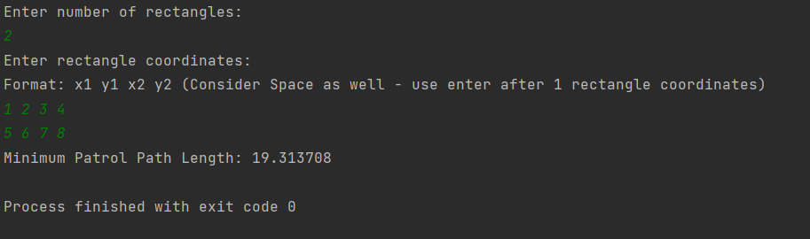
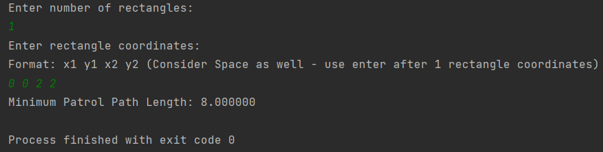
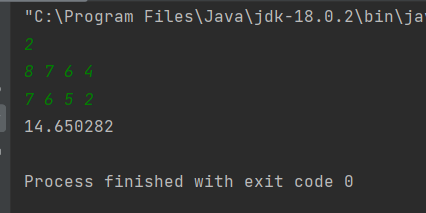

# Optimal_Patrol_Path_Around_Machines

Optimal Patrol Path Around Machines
Overview

This project solves a geometric optimization problem where we need to find the shortest possible closed path that encloses a set of rectangular machines placed on a 2D plane.

The robot must patrol around all machines without entering their interiors, and the goal is to minimize the total travel distance.

The key idea is that the optimal patrol path is the convex hull of all rectangle corner points.

Idea / Approach

Instead of dealing with rectangles directly, we simplify the problem:

Each rectangle is broken into its 4 corner points.
We treat all these corners as a set of points in a plane.
The problem becomes:
“Find the smallest perimeter polygon that encloses all points.”

This is exactly the Convex Hull problem.

I used Andrew’s Monotone Chain Algorithm to compute the convex hull efficiently.

Why Convex Hull Works

If you imagine stretching a rubber band around all the points, it naturally wraps around only the outermost points.

That boundary is the shortest possible enclosing shape.

So:

Any inward dents would only increase distance
Convex hull removes all unnecessary inner points
Result is the minimum perimeter enclosing path
Mathematical Concepts Used
1. Orientation Test (Cross Product)

Used to determine whether three points make a left or right turn:

cross(O, A, B) = (Ax - Ox)(By - Oy) - (Ay - Oy)(Bx - Ox)

0 → left turn

< 0 → right turn
= 0 → collinear

This helps remove points that break convexity.

2. Euclidean Distance

Used to calculate distance between two hull points:

d(A, B) = sqrt((Ax - Bx)^2 + (Ay - By)^2)
3. Perimeter Calculation

Final answer is sum of all hull edges:

P = Σ distance(Hi, H(i+1))   (cyclic)
⚙️ Algorithm Steps
Read all rectangles
Convert each rectangle into 4 corner points
Sort all points
Build lower hull
Build upper hull
Merge both to form full convex hull
Compute perimeter of hull
Output result
⏱ Time Complexity
Sorting points: O(N log N)
Convex hull construction: O(N)
Perimeter calculation: O(N)

Overall complexity:
O(N log N)

Input Format
N
x1 y1 x2 y2
x1 y1 x2 y2
...

Each line represents opposite corners of a rectangle.

Output Format

Single floating-point number:

minimum perimeter of convex hull

Printed with precision of 6 decimal places.

Implementation Details

Language: Java
Data structure: ArrayList for dynamic point storage
Geometry: Cross product + Euclidean distance
Algorithm: Andrew’s Monotone Chain Convex Hull

Simple term: 

The solution reduces a rectangle-based geometry problem into a classic convex hull problem and computes the minimum enclosing perimeter efficiently using computational geometry techniques.
Output screenshots

